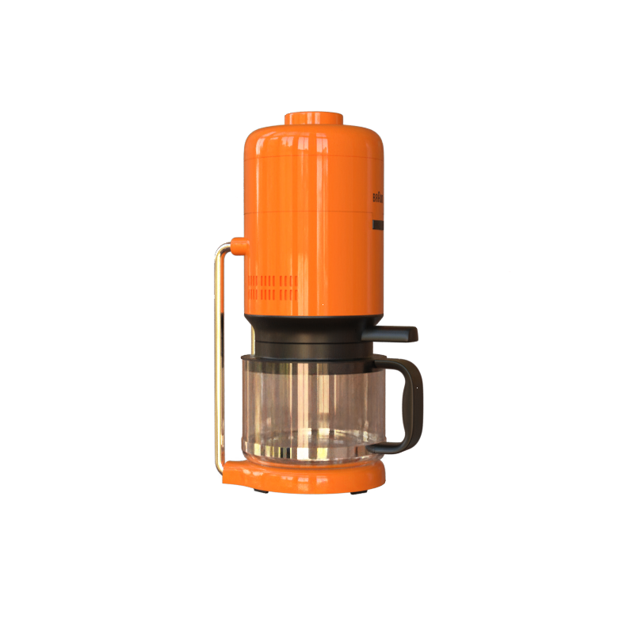
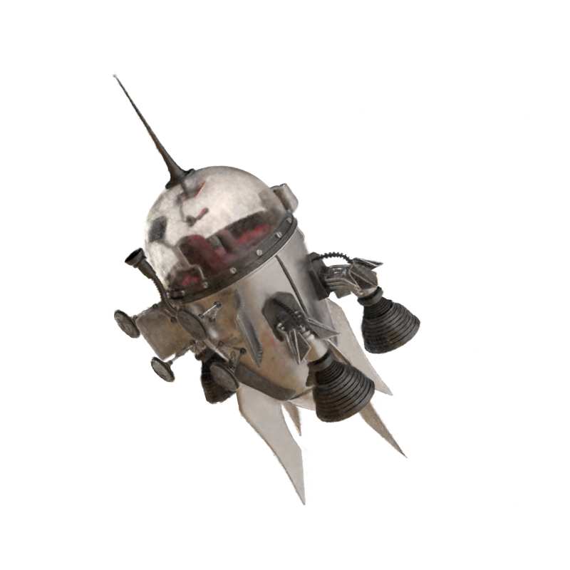

# jittor [人工智能算法挑战赛](https://www.educoder.net/competitions/index/Jittor-3)可微渲染新视角生成赛题 洗脚点心队 [JNeRF](https://github.com/Jittor/JNeRF)



# 简介
本项目包含了第二届计图挑战赛-可微渲染新视角生成比赛的代码实现。该项目是本次比赛A榜Top3，B榜Top2.
本项目基于[JNeRF](https://github.com/Jittor/JNeRF)开发，其特点是：
1. 通过MVS方法获取较为准确的相机参数，使得Car和Easyship场景下更好的结果；
2. 修改渲染方程，改为6通道rgb渲染，将反射光和透射光分离，提升NeRF对透明物体的渲染效果；该方法只用在了Easyship上，psnr提升了1个点。
3. 调整aabb，scale，offset等参数，使得物体占据aabb中的最优位置，提升细节表现力。

另外，我们还做了一些小更改：
- 改进了训练脚本和显示方式，修改数据集加载的位置，减少显存占用。
- 增加了模型查看GUI，基于dearpygui。
- 增加了数据集json处理脚本，利用icp和插值算法修正数据集中的位姿错误。


# 安装
## 运行依赖
- jittor >= 1.3.4.16
- cuda == 11.4
- dearpygui
- 其他请参考[JNeRF](https://github.com/Jittor/JNeRF)

## 训练时间
单个场景在1张2070s上训练时间约为10分钟,5个场景大约需要50分钟。更长的训练时间几乎不再提升psnr。

# 使用方法
1. 修改projects/ngp/configs/ngp_comp.py中的exp_name以选择不同的场景。
2. 修改test.sh中的task以执行不同的任务。
   - train执行训练任务，训练时只显示loss，训练完成后会加载验证集，输出平均最小和最大的psnr。
   - test会渲染输出A榜测试集图片。
   - B_test会渲染输出B榜测试集图片。
   - val_all加载验证集，输出平均最小和最大的psnr。
   - gui启动图形界面，可以通过鼠标自由查看模型。

使用以下指令执行任务：
```
   sh test.sh
```

# 致谢
本项目基于[JNeRF](https://github.com/Jittor/JNeRF)实现。
